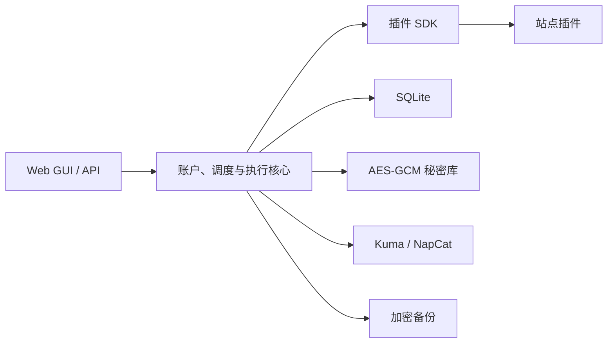

# AutoSign

AutoSign 是一个面向 NAS 与 Docker 的自托管自动签到平台。它把账户、加密登录状态、定时计划、执行记录、消息通知和备份放在统一的 Web GUI 中，同时将每个网站的登录与签到逻辑封装为独立插件，方便继续扩展新站点。

> [!IMPORTANT]
> 本项目仅用于管理你本人有权使用的账户。使用前请确认目标网站允许自动化访问，并自行控制签到频率。项目不会尝试绕过 Cloudflare、验证码或网站的反自动化策略。

## 功能

- Web GUI 管理账户、交互登录、定时计划和执行记录
- Playwright 交互式登录，登录状态使用 AES-GCM 加密后保存
- SQLite 持久化，内置数据库迁移
- 每日定时执行、随机延迟、失败重试和时区设置
- Uptime Kuma Push 与 NapCat OneBot HTTP 通知渠道
- 手动及每日自动加密备份、校验和安全暂存恢复
- 首次启动创建管理员密码，包含 HttpOnly 会话、CSRF 防护与登录限速
- 插件 SDK 与核心调度解耦，新增网站无需修改核心业务

## 内置插件

| 插件 | 用途 | 登录方式 |
| --- | --- | --- |
| Demo | 不访问外部网站，用于验证整条执行流程 | 无需登录 |
| 百度贴吧 | 发现关注贴吧并逐一签到 | 百度原生交互登录 |
| 百合会 | 执行论坛每日打卡 | 网站交互登录 |
| ACGRip | 执行 Discuz DSU 每日签到 | 网站交互登录 |

网站页面与接口随时可能变化。插件失效时请先查看容器日志和最近签到记录，再提交 Issue；Issue 中不要粘贴 Cookie、Token、完整页面存档或真实账号信息。

## 架构



核心代码不会保存站点专属 URL、字段或结果判断；这些内容都属于 `autosign.plugins`。插件只能通过 `autosign.plugin_sdk` 提供的上下文使用浏览器、秘密和日志能力。

## 快速开始：Docker Compose

要求：Docker Engine 与 Docker Compose v2。首次构建需要访问软件包源并下载 Chromium。

### Windows PowerShell

```powershell
git clone https://github.com/<你的用户名>/<仓库名>.git
Set-Location <仓库名>

py -m venv .venv
.\.venv\Scripts\python.exe -m pip install -e .
Copy-Item .env.example .env
.\.venv\Scripts\python.exe -m autosign init-key

docker compose up -d --build
```

### Linux / NAS SSH

```bash
git clone https://github.com/<你的用户名>/<仓库名>.git
cd <仓库名>

python3 -m venv .venv
.venv/bin/pip install -e .
cp .env.example .env
.venv/bin/python -m autosign init-key

docker compose up -d --build
```

打开 <http://127.0.0.1:8000>。从另一台设备访问时，把 `127.0.0.1` 换成部署主机的局域网地址。首次打开会要求创建至少 12 个字符的管理员密码。

查看状态和日志：

```bash
docker compose ps
docker compose logs --tail 200 autosign
```

停止服务：

```bash
docker compose down
```

## 配置

公开仓库只包含 `.env.example`。请复制为 `.env` 后填写，绝对不要提交真实 `.env`。

| 变量 | 默认值 | 说明 |
| --- | --- | --- |
| `AUTOSIGN_MASTER_KEY` | 无 | 加密 Cookie、Token 等秘密；必须生成并妥善备份 |
| `AUTOSIGN_DATA_DIR` | `./data` | SQLite、日志和备份目录 |
| `AUTOSIGN_PORT` | `8000` | 容器内服务端口 |
| `AUTOSIGN_BROWSER_HEADLESS` | `true` | 本地开发的浏览器模式；Docker 配置已使用虚拟显示 |
| `AUTOSIGN_SCHEDULER_POLL_SECONDS` | `15` | 调度器检查间隔 |
| `AUTOSIGN_AUTH_SECURE_COOKIE` | `false` | 仅在已通过 HTTPS 访问时设为 `true` |
| `AUTOSIGN_BACKUP_ENABLED` | `false` | 是否启用每日自动备份 |
| `AUTOSIGN_BACKUP_DAILY_TIME` | `03:30` | 自动备份时间，格式 `HH:MM` |
| `AUTOSIGN_BACKUP_TIMEZONE` | `Asia/Shanghai` | 自动备份时区 |
| `AUTOSIGN_BACKUP_RETENTION_COUNT` | `7` | 自动备份保留份数 |
| `AUTOSIGN_BACKUP_PASSWORD` | 无 | 自动备份的独立强密码，至少 12 个字符 |

`AUTOSIGN_MASTER_KEY` 与 `data/` 缺一不可。主密钥丢失后，数据库内加密保存的登录状态和通知凭据无法恢复，因此应将二者一起备份，但不要放入 Git 仓库。

## 使用流程

1. 在首页选择插件并创建账户。
2. 对需要登录的站点点击“交互登录”，在嵌入的目标页面完成网站原生登录。
3. 点击保存登录状态，然后手动执行一次账户签到。
4. 在“自动签到计划”中设置时间、时区、随机延迟与重试策略。
5. 按需创建 Uptime Kuma 或 NapCat 渠道，再把渠道分配给账户。
6. 在“系统备份”中配置每日加密备份，并至少完成一次备份校验。

不要把管理端口直接暴露到公网。远程访问建议使用可信局域网、VPN，或配置 HTTPS 反向代理；启用 HTTPS 后同时设置 `AUTOSIGN_AUTH_SECURE_COOKIE=true`。

## NAS 部署说明

根目录的 `compose.nas.yaml` 是一个 NAS 示例，使用预先导入的镜像、`18080` 主机端口和绝对数据目录。使用前必须按自己的设备修改：

- `image`：本机实际导入的镜像名称与版本
- `ports`：没有冲突的主机端口
- `volumes`：NAS 上真实存在且容器可写的数据目录
- `.env`：新生成的主密钥和可选备份配置

通用设备优先使用 `compose.yaml` 自行构建。不要把为个人 NAS 修改后的 Compose 文件提交回公开仓库。

## 加密备份与恢复

在运行中的容器内创建手动备份：

```bash
docker exec -it autosign python -m autosign backup
```

校验备份：

```bash
docker exec -it autosign python -m autosign backup-check /data/backups/<文件名>.asbackup
```

安全暂存恢复内容：

```bash
docker exec -it autosign python -m autosign restore /data/backups/<文件名>.asbackup
```

恢复命令不会覆盖在线数据库，而是将校验后的内容解包到新的 `data/restores/<时间>/` 目录。请先停止服务并额外备份当前数据，再按照其中的 `RESTORE_INSTRUCTIONS.txt` 人工替换。备份密码不能找回，也不应与管理员密码共用。

## 本地开发

要求 Python 3.11 或更高版本。

```powershell
py -m venv .venv
.\.venv\Scripts\python.exe -m pip install -e ".[dev]"
.\.venv\Scripts\python.exe -m playwright install chromium
Copy-Item .env.example .env
.\.venv\Scripts\python.exe -m autosign init-key
.\.venv\Scripts\python.exe -m autosign
```

运行质量检查：

```powershell
.\.venv\Scripts\python.exe -m ruff check .
.\.venv\Scripts\python.exe -m pytest
```

## 新增站点插件

新插件应实现 `autosign.plugin_sdk.AutoSignPlugin` 契约，并放在 `src/autosign/plugins/`。建议保持以下边界：

- 插件声明自身标识、显示名称、登录入口和所需秘密。
- 登录检测、页面字段、站点 URL 与返回结果解析只写在插件内。
- 通过执行上下文访问浏览器、加密秘密和结构化日志。
- 为登录判断、成功、今日已签、失效和异常响应分别编写测试。
- 不提交真实 Cookie、网页存档、账号名或目标站点返回的个人数据。

## 目录结构

```text
src/autosign/
├── core/          # 配置、数据库、调度、执行、通知、备份与安全
├── migrations/    # Alembic 数据库迁移
├── plugin_sdk/    # 站点插件稳定契约
├── plugins/       # 独立站点实现
└── web/           # FastAPI、数据模型与前端资源
tests/             # 单元与集成测试
```

## 安全报告

如果发现可能导致 Cookie、Token、主密钥或管理员会话泄露的问题，请不要在公开 Issue 中附带可用凭据。先撤销相关凭据并轮换主密钥或密码，再使用不含私人数据的最小复现描述问题。

## 许可证

本项目采用 [MIT License](LICENSE)。
