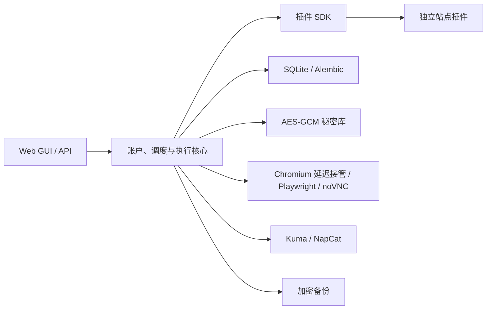

# AutoSign

[](https://github.com/Adrenaline036/AutoSign/actions/workflows/ci.yml)
[](https://www.python.org/)
[](LICENSE)

AutoSign 是一个面向 NAS 与 Docker 的自托管自动签到平台。它提供统一的 Web GUI，用于管理账户、网站登录状态、定时任务、执行记录、消息通知和加密备份；每个网站的签到实现均为独立插件，核心调度与站点逻辑彼此解耦。

> [!IMPORTANT]
> 本项目仅用于管理你本人有权使用的账户。请遵守目标网站的服务条款并控制访问频率。AutoSign 不会绕过验证码、Cloudflare 或其他反自动化措施；需要安全验证时，应通过实时交互浏览器由用户本人完成。

## 功能概览

- 新增 VikACG 每日签到插件。
- 百合会插件兼容初始 HTTP 405 JavaScript/WAF 挑战。
- Docker 交互登录升级为受管理员会话保护的 noVNC 实时浏览器。
- 浏览器状态支持 Cookie、localStorage、sessionStorage 与 IndexedDB。
- 修复 Playwright 1.55 在部分 IndexedDB 外部键上的导出/恢复问题。
- 登录状态恢复、按钮点击和签到结果均经过独立验证，不会把“点击过”直接当作“签到成功”。
- 闲置交互登录会话由后台主动回收，不再长期占用 Chromium Context。
- SQLite 默认使用 WAL、连接级外键检查、`busy_timeout` 与 `synchronous=NORMAL`。
- Docker 基础镜像、Python 依赖、Playwright 与对应 Chromium revision 均显式锁定。

## 主要功能

- 账户、计划、执行记录与通知渠道的 Web GUI
- Playwright 驱动的网站原生登录与签到
- noVNC 实时浏览器；登录期间先运行普通容器 Chromium，完成后才由 Playwright 接管并保存状态
- AES-GCM 加密保存网站登录状态及通知凭据
- SQLite 持久化与 Alembic 自动迁移
- SQLite WAL 并发读写、异常退出恢复与包含 WAL 数据的一致性备份
- 每日计划、时区、随机延迟、失败重试与手动执行
- Uptime Kuma Push 与 NapCat/OneBot HTTP 通知
- 每日自动通知汇总及最终签到结果推送
- 手动/自动加密备份、备份校验与安全暂存恢复
- 管理员密码、HttpOnly 会话、CSRF 防护与登录限速
- 稳定的插件 SDK 和可独立测试的站点实现

## 内置插件

| 插件 | 版本 | 功能 | 登录方式 |
| --- | --- | --- | --- |
| Demo | 内置 | 不访问外部网站，用于验证执行与通知链路 | 无需登录 |
| 百度贴吧 | 内置 | 获取关注贴吧并逐一签到 | 百度原生交互登录 |
| 百合会 | 0.2.3 | 论坛每日打卡，有界等待初始百度 WAF 挑战并容忍页面切换时的瞬时正文超时 | 网站交互登录 |
| ACGRip | 内置 | Discuz DSU 每日签到 | 网站交互登录 |
| VikACG | 0.3.2 | 从 Local Storage/IndexedDB 读取账户状态，API 优先签到与令牌自动刷新 | 网站交互登录或 accountStore3 恢复 |

网站页面和接口可能随时变化。插件失效时，请先检查最近执行记录与容器日志；公开 Issue 中不要附带 Cookie、Token、完整浏览器状态、真实账号或包含个人信息的页面存档。

## 架构



核心负责账户、调度、持久化、加密、通知、备份和浏览器生命周期；插件负责站点 URL、登录判断、页面字段、点击方式及签到结果验证。新增站点无需把站点专属分支写入核心。

## 快速开始

要求：

- Docker Engine
- Docker Compose v2
- 首次构建时能够下载 Python 依赖与 Chromium
- 用于初始化主密钥的 Python 3.11 或更高版本

### Linux / NAS

```bash
git clone https://github.com/Adrenaline036/AutoSign.git
cd AutoSign

python3 -m venv .venv
.venv/bin/pip install -e .
cp .env.example .env
.venv/bin/python -m autosign init-key

docker compose up -d --build
```

### Windows PowerShell

```powershell
git clone https://github.com/Adrenaline036/AutoSign.git
Set-Location AutoSign

py -m venv .venv
.\.venv\Scripts\python.exe -m pip install -e .
Copy-Item .env.example .env
.\.venv\Scripts\python.exe -m autosign init-key

docker compose up -d --build
```

打开 <http://127.0.0.1:8000>。从其他设备访问时，将 `127.0.0.1` 换成部署主机的局域网地址。首次进入会要求创建至少 12 个字符的管理员密码。

```bash
docker compose ps
docker compose logs --tail 200 autosign
```

## 首次使用

1. 在首页选择插件并创建账户。
2. 点击“交互登录”，在新打开的实时浏览器标签中完成网站原生登录和安全验证；先点击远端输入框即可直接粘贴，必要时使用页面顶部的隐藏粘贴输入框。
3. 关闭实时浏览器标签，返回 AutoSign，点击“登录完成，检测并保存”。
4. 手动执行一次签到，确认结果为成功或今日已签。
5. 设置每日执行时间、时区、随机延迟和重试策略。
6. 创建 Uptime Kuma 或 NapCat 渠道，并分配给相应账户。
7. 配置加密备份，并至少完成一次备份校验。

## 浏览器登录状态

AutoSign 将以下浏览器状态合并保存：

- Cookie
- localStorage
- sessionStorage
- IndexedDB

状态在写入 SQLite 前由 `AUTOSIGN_MASTER_KEY` 使用 AES-GCM 加密。API 和 GUI 只返回已保存秘密的名称，不回显内容。

Docker 中的 Chromium 运行在虚拟显示环境。交互登录期间 Chromium 作为普通 X11 进程启动，Playwright 不参与启动或输入；只有用户点击“登录完成，检测并保存”后，AutoSign 才通过容器回环 CDP 接管并导出状态。原始 VNC 与 CDP 均只监听容器回环地址；noVNC 静态资源与 WebSocket 转发要求有效的管理员会话。无需映射 `5900` 或调试端口，也不应将其暴露到公网。

粘贴文本通过现有的管理员会话和 CSRF 校验后写入当前聚焦的远端输入框。备用输入框默认隐藏内容；文本发送后立即清空，不写入 AutoSign 数据库，成功提示也只显示字符数。

## 配置

复制 `.env.example` 为 `.env` 后修改。真实 `.env` 不应提交到 Git。

| 变量 | 默认值 | 说明 |
| --- | --- | --- |
| `AUTOSIGN_MASTER_KEY` | 无 | 加密登录状态和通知凭据；使用 `python -m autosign init-key` 生成 |
| `AUTOSIGN_DATA_DIR` | `./data` | SQLite、日志、备份和暂存恢复目录 |
| `AUTOSIGN_PORT` | `8000` | AutoSign 服务端口 |
| `AUTOSIGN_DATABASE_BUSY_TIMEOUT_MS` | `2000` | SQLite 写锁冲突最大等待毫秒数；不是固定请求延迟 |
| `AUTOSIGN_BROWSER_HEADLESS` | `true` | 是否使用无界面 Chromium；Docker 示例使用虚拟显示下的 headful 模式 |
| `AUTOSIGN_BROWSER_HIDE_WINDOW` | `false` | 桌面开发时将原生 headful 窗口移出屏幕 |
| `AUTOSIGN_BROWSER_LIVE_ENABLED` | `false` | 启用 noVNC 实时登录；Docker 示例已开启 |
| `AUTOSIGN_BROWSER_NATIVE_EXECUTABLE` | 无 | 普通浏览器延迟接管入口；官方 Docker 示例指向镜像内固定 Chromium 启动器 |
| `AUTOSIGN_BROWSER_SESSION_TIMEOUT_SECONDS` | `900` | 交互登录会话最大闲置秒数 |
| `AUTOSIGN_BROWSER_SESSION_CLEANUP_POLL_SECONDS` | `60` | 后台清理过期交互会话的轮询秒数 |
| `AUTOSIGN_BROWSER_AUTOMATION_CAPACITY` | `2` | 同时执行的浏览器自动化操作上限；NAS 内存压力较高时可降为 `1` |
| `AUTOSIGN_BROWSER_INTERACTIVE_CAPACITY` | `1` | 独立预留的交互登录会话上限，不与自动签到共享配额 |
| `AUTOSIGN_BROWSER_PROXY_SERVER` | 无 | 可选浏览器 HTTP/SOCKS 代理；同时用于延迟接管登录与自动签到，可能包含凭据，不要提交 |
| `AUTOSIGN_BROWSER_PROXY_BYPASS` | 无 | 逗号分隔的代理绕过域名 |
| `AUTOSIGN_SCHEDULER_POLL_SECONDS` | `15` | 调度器轮询间隔 |
| `AUTOSIGN_AUTH_SECURE_COOKIE` | `false` | 仅通过 HTTPS 访问时设为 `true` |
| `AUTOSIGN_BACKUP_ENABLED` | `false` | 是否开启每日自动备份 |
| `AUTOSIGN_BACKUP_DAILY_TIME` | `03:30` | 自动备份时间，格式 `HH:MM` |
| `AUTOSIGN_BACKUP_TIMEZONE` | `Asia/Shanghai` | 自动备份时区 |
| `AUTOSIGN_BACKUP_RETENTION_COUNT` | `7` | 自动备份保留数量 |
| `AUTOSIGN_BACKUP_PASSWORD` | 无 | 自动备份独立密码，至少 12 个字符 |

交互登录的“活动”仅指用户对远端网页执行点击、滚轮、键盘输入或粘贴；GUI 的会话状态查询和截图刷新不会延长闲置期限。会话到期后，主 GUI 会关闭登录弹窗，容器日志会记录回收数量。

`AUTOSIGN_MASTER_KEY` 和 `data/` 必须配套备份。丢失主密钥后，数据库内已有加密状态无法恢复。不要在初始化过的实例上重新生成或覆盖主密钥。

## NAS 部署

仓库中的 `compose.nas.yaml` 是通用示例，适用于已提前导入本地镜像的 NAS。使用前必须修改：

- `image`：实际镜像名称与版本
- `ports`：未被占用的主机端口
- `volumes`：NAS 上真实存在且容器 UID `10001` 可写的数据目录
- `.env`：该实例专属且已备份的主密钥
- 资源限制：根据设备内存和并发浏览器数量调整

首次遇到目录权限问题时，可参考 `compose.nas.bootstrap.yaml` 的一次性权限初始化服务。不要把包含个人路径、代理、固定域名解析或凭据的 NAS Compose 提交回公开仓库。

公开 Dockerfile 使用带 digest 的 Python 基础镜像，并从 `requirements.docker.lock` 安装精确版本。更新基础镜像、Playwright 或锁文件时应作为明确版本变更执行完整测试；Playwright 的固定版本同时固定其下载的 Chromium revision。

目标网站的可达性取决于部署网络。可使用 `AUTOSIGN_BROWSER_PROXY_SERVER` 与 `AUTOSIGN_BROWSER_PROXY_BYPASS` 做通用浏览器分流，但 AutoSign 不内置任何私人代理节点、固定 IP 或区域绕过配置。

如果目标页面已经显示但按钮长期无响应，先在浏览器开发者工具的 Network 面板分别检查主文档、同源 JavaScript/CSS 和第三方统计资源。单独的统计脚本失败通常不足以解释站点功能异常；主文档或同源大资源出现长时间 Pending、吞吐抖动时，应在同一部署网络中对直连与代理路线做无凭据对照。不要把临时验证过的 CDN IP 当作长期配置：边缘路由质量可能变化，固定地址也会绕过后续 DNS 与代理策略。调整分流后，应依次确认主文档无安全验证循环、普通交互浏览器可操作，以及保存状态后的插件执行仍通过。

## 通知渠道

### Uptime Kuma Push

为账户分配 Push URL 后，每次最终执行结果都会更新对应监控。Kuma 的心跳间隔应大于“24 小时 + 最大随机延迟 + 最大重试窗口”，避免正常延迟被判为离线。

### NapCat / OneBot

支持通过 OneBot HTTP 接口发送 QQ 通知。服务地址、访问令牌和目标 QQ/群号均作为加密秘密保存。AutoSign 与 NapCat 不在同一网络时，应先使用 VPN、反向代理或其他受控网络连接验证 HTTP 可达性。

## 加密备份与恢复

运行中的数据库使用 WAL 时，加密备份通过 SQLite Online Backup API 创建一致性快照，已提交但尚未 checkpoint 回主数据库文件的记录也会包含在备份中。不要直接复制单独的 `autosign.db` 代替 AutoSign 备份功能。

创建加密备份：

```bash
docker exec -it autosign python -m autosign backup
```

校验备份：

```bash
docker exec -it autosign python -m autosign backup-check /data/backups/<backup>.asbackup
```

安全暂存恢复：

```bash
docker exec -it autosign python -m autosign restore /data/backups/<backup>.asbackup
```

`restore` 不会覆盖在线数据库，而是将校验后的内容解包到新的 `data/restores/<时间>/` 目录。停止服务并额外备份当前数据后，再按照生成的 `RESTORE_INSTRUCTIONS.txt` 人工替换。备份密码无法找回，也不应与管理员密码共用。

## 升级

支持的直接升级起点为首个公开源码版本 `0.13.1`；更早的内部开发版本不属于常规兼容范围。升级仍应保留原数据库、数据目录和 `AUTOSIGN_MASTER_KEY`。

1. 创建并校验一次加密备份。
2. 备份当前 `.env` 和整个数据目录。
3. 拉取新代码或导入新镜像。
4. 保留原 `AUTOSIGN_MASTER_KEY` 和数据挂载，重新创建容器。
5. 检查 `/healthz`、账户列表、计划、通知渠道及最近执行记录。
6. 分别手动执行关键账户，再恢复自动计划。

数据库迁移会在容器启动时自动执行。不要通过删除数据库或重新生成主密钥来解决升级问题。

管理页的 Demo 测试统一使用“创建 Demo 账户 → 执行账户签到”，不再提供绕过账户记录、通知和生命周期门的 `/api/v1/plugins/{plugin_id}/execute` 直执行接口；API 调用者应改用 `POST /api/v1/accounts/{account_id}/execute`。交互登录现在始终从干净会话开始，旧 `clean` query 参数已弃用并被忽略；保存状态只会在自动签到时恢复。

通知渠道迁移只在首次需要时扫描旧账户秘密，成功后记录完成状态，后续启动不再重复扫描。如果从早期内部版本升级后发现 Uptime Kuma 或 NapCat 渠道缺失，应先停止正式服务并校验备份，再执行一次显式修复：

```powershell
.\.venv\Scripts\python.exe -m autosign repair-legacy-notifications
```

Docker Compose 环境可在停止正式服务后使用同一数据卷和主密钥运行一次性命令：

```bash
docker compose stop autosign
docker compose run --rm autosign python -m autosign repair-legacy-notifications
docker compose up -d autosign
```

修复过程会复用已存在的相同渠道和账户分配；若中途失败，不会写入完成标记，下次启动或再次执行修复时会继续幂等处理。不要在正式容器仍写入数据库时并行运行修复命令。

## 本地开发

```powershell
py -m venv .venv
.\.venv\Scripts\python.exe -m pip install -e ".[dev]"
.\.venv\Scripts\python.exe -m playwright install chromium
Copy-Item .env.example .env
.\.venv\Scripts\python.exe -m autosign init-key
.\.venv\Scripts\python.exe -m autosign
```

质量检查：

```powershell
.\.venv\Scripts\python.exe -m ruff check .
.\.venv\Scripts\python.exe -m pytest
```

## 新增插件

新插件应实现 `autosign.plugin_sdk.AutoSignPlugin`，并放在 `src/autosign/plugins/` 或通过 `autosign.plugins` entry point 发布。

当前只支持插件 SDK `api_version=1`；registry 会在发现阶段拒绝其他版本，避免未知契约进入执行路径。SDK v1 的 `PluginManifest` 字段以及 `PluginContext.settings`、`logger`、`browser`、`secrets` 保持兼容：`domains`、`settings_schema` 和 `capabilities` 作为插件/API 元数据保留，`secrets` 只提供当前账户作用域的秘密读取。

`check_session()` 是已弃用的 v1 兼容钩子，生产执行不会单独调用它；默认返回 `UNKNOWN`，插件必须在 `sign()` 内完成实际登录态判断。`PluginContext.http` 从未由 AutoSign 注入，现已标记弃用并始终为 `None`；新插件应使用受限的 `browser` 能力或自行封装站点客户端。上述弃用成员只会在未来 SDK v2 中删除。

插件应负责：

- 插件标识、显示名称、版本、域名和登录入口
- 登录状态判断与站点字段解析
- 签到动作及成功、今日已签、失效、异常结果判定
- 必要的站点兼容和结构化诊断摘要

核心负责：

- 账户、数据库、调度和重试
- 浏览器会话与加密状态
- 通知、日志和备份
- 插件生命周期与稳定上下文接口

每个插件至少应覆盖成功、今日已签、登录失效和页面异常测试。测试与 Issue 中不得包含真实账户、Cookie、Token 或个人页面内容。

## 项目结构

```text
src/autosign/
├── core/          # 配置、数据库、调度、通知、备份、浏览器与安全
├── migrations/    # Alembic 数据库迁移
├── plugin_sdk/    # 插件契约
├── plugins/       # 内置站点插件
└── web/           # FastAPI、Schema 与前端资源
tests/             # 单元和集成测试
```

## 安全建议

- 不要提交 `.env`、`data/`、数据库、备份、日志、浏览器状态或私人 Compose。
- 不要将管理端口、VNC 端口或无认证代理暴露到公网。
- 远程访问优先使用可信局域网、VPN 或 HTTPS 反向代理。
- 启用 HTTPS 后设置 `AUTOSIGN_AUTH_SECURE_COOKIE=true`。
- 凭据疑似泄露时，应立即撤销网站会话、轮换通知令牌并更换相关密码。
- 安全问题请使用不含可用凭据的最小复现信息报告。

## 许可证

本项目采用 [MIT License](LICENSE)。
